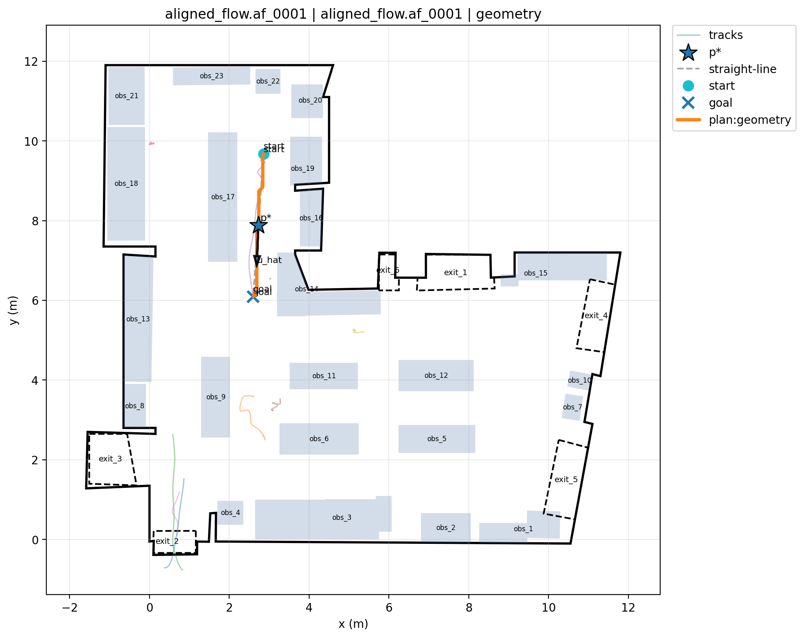

# EvenFlow

EvenFlow is an evaluation suite for shared-space navigation, built from real human trajectory data.

Most benchmarks evaluate whether an agent can navigate *around* people.  
**EvenFlow evaluates whether an agent can navigate *with* them.**

It converts real-world human trajectories into executable navigation tasks, enabling trajectory-level evaluation of planner behavior in realistic environments.

---

## ⚡ Getting Started in 2 Minutes

### 1. Install

```bash
git clone https://github.com/standard-ai/evenflow-benchmark.git
cd evenflow-benchmark
pip install .
```

---

### 2. Download the dataset

```bash
pip install huggingface_hub

hf download standard-cognition/EvenFlow \
  --repo-type dataset \
  --local-dir data
```

---

### 3. Visualize a scene

```bash
evenflow render-scene \
  data/benchmark/aligned_flow/scenes/aligned_flow.af_0001.scene.json \
  outputs/scene.png \
  --show-tracks \
  --max-tracks 50
```

---

### 4. Run a planner (geometric baseline)

```bash
evenflow run-geometry \
  data/benchmark/aligned_flow/tasks/aligned_flow.af_0001.task.json \
  examples/robots/simple_disk.json \
  outputs/plan.json
```

---

### 5. Validate the plan

```bash
evenflow validate-plan outputs/plan.json
```

---

### 6. Evaluate the plan

```bash
evenflow evaluate-plan \
  data/benchmark/aligned_flow/tasks/aligned_flow.af_0001.task.json \
  examples/robots/simple_disk.json \
  outputs/plan.json
```

---

### 7. Visualize the result

```bash
evenflow render-plan \
  data/benchmark/aligned_flow/tasks/aligned_flow.af_0001.task.json \
  outputs/plan.json \
  outputs/render.png \
  --show-tracks
```

---

### ✅ Expected Result

After running the above steps, you should see a rendered plan similar to:



This shows the planner trajectory (orange) over real human movement.


## 🧪 Quickstart to Writing a Custom Planner

EvenFlow is designed to evaluate arbitrary planners. You only need to implement a minimal interface.

### Minimal interface

```python
def plan(task, robot):
    # Your planner logic here
    return PlanResult(...)
```

### Required output

Your planner must return a **PlanResult** containing:

- `success` (bool)
- `track` (TrackSimple)
- `runtime_s` (float)

### Key requirement

The output trajectory must be **time-parameterized**.

EvenFlow evaluates behavior over time—not just geometric feasibility.

### Running your planner

Add a simple wrapper and call:

```bash
evenflow run \
  <task.json> \
  <robot.json> \
  --planner your_planner
```

### Reference example

See the geometric baseline:

```
evenflow/planners/geometry/
```

---

## Dataset

👉 https://huggingface.co/datasets/standard-cognition/EvenFlow

---

## License

Custom research license. See LICENSE file.
